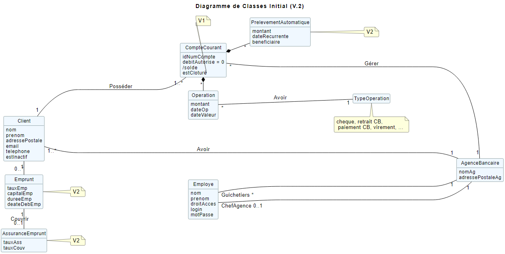

# DOCUMENTATION TECHNIQUE VERSION 1
:toc: left
:toc-title: Table des matières
:icons: font
:nofooter:

Version de l’application : 0
Date : semaine 20
Equipe : Christopher / Ruben / Yann 
Client : BankUniv
Projet : DailyBank

## Présentation générale

### Use Case global

L'utilisation de l'application DailyBank se fait par deux utilisateurs distincts : 

*Les guichetiers* : Ils possèdent les droits leur permettant de gérer les clients de l'Agence bancaire ainsi que leur comptes. +
Ainsi ils peuvent :

* gérer les clients de l'Agence bancaire :
** Rechercher les clients 
** Ajouter de nouveaux clients 
** Modifier les informations des clients
* gérer les comptes bancaire des clients :
** voir les opérations d'un compte bancaire

*Les Chefs d'Agence* : Ils possèdent les mêmes droits que les guichetiers et gèrent en plus les employés. +
Ainsi ils peuvent : 

* gérer le CRUD des employés

### Diagramme de classe de données 

Une agence bancaire peut posséder plusieurs clients qui possédent un certain nombres de comptes bancaire. Ces comptes bancaires peuvent avoir réalisé un certain nombre d'opérations.

## Architecture

### Architecture générale

L'application est développer en utilisant le langage de programmation Java dans sa version 1.8, son framework JavaFX qui permet de mettre en place l'interface graphique, ainsi qu'une base de données Oracle. +
Elle est utilisée pour permettre au employés d'une Agence bancaire comprise parmis celles de DailyBank, de gérer les clients de leur Agence ainsi que leur comptes bancaire et les opérations de ces comptes. +
De la même manière, elle permet aux employés possédant les droits nécessaire de gérer les employés de leur Agence bancaire. 

### Ressources externes 

Plusieurs fichier .jar ayant des rôles précis sont utilisés pour cette application :

* DailyBankApp.jar : il permet de lancer l'application pour l'utiliser

### Structuration en packages

* Application : +
Continent les fichiers en .java qui permettent de lancer l'application.

* Application.control : +
Contient les contrôleurs de dialogue permettant l'accès aux données de l'application. En d'autres termes, il contient tous les fichiers .java permettant de représenter toutes les fenêtres de l'application.

* Application.view : +
Continent toutes les vues de l'application, c'est à dire tous les classes .fxml ainsi que les controlleurs associés. En d'autres termes, il contient tous les classes permettant l'interaction avec l'application (gestion des vues et contrôles des saisies)

* Application.tools : +
Contient tous les classes utilisé pour le package view et le package control.

* Model.data : +
Contient les classes permettant d'intéragir avec la Base de Données puisque les classes de ce package représente les tables de la Base de Données.

* Model.orm : +
Continent toutes les classes qui permettent d'effectuer des requêtes SQL dans la Base de Données. 

* Model.exception : +
Contient toutes les classes qui gère les différentes exception de l'application.

## Fonctionnalités de l'application

### Connexion / Deconnexion d'un compte

NOTE: Fonctionnalité de la version existante 

### Gestion des clients 

NOTE: Fonctionnalité de la version existante

### Recheche des clients

NOTE: Fonctionnalité de la version existante

### Gestion des comptes bancaire

NOTE: Fonctionnalité de la version existante

Cette fonctionnalité permet de consulter la liste des comptes d'un client de l'Agence. +
Lorsque l'utilisateur clique sur le bouton « comptes client », le contrôleur de vue comptesmanagementcontroller transfère les information nécessaire au contrôle comptesmanagement pour l'affichage de la fenêtre de gestion des comptes. +
La fenêtre de gestion des comptes s'ouvre et grâce au transfère des informations nécessaire à l'affichage de la liste des comptes à la classe AccessCompte.

### Voir les opérations d'un compte bancaire

NOTE: Fonctionnalité de la version existante

Cette fonctionnalité permet de consulter la liste des opérations du compte d'un client. +
Lorsque le client clique sur le bouton « voir opérations », le contrôleur de vue comptesmanagementcontroller transfère les informations nécessaire au contrôle operation operationmanagement pour l'affichage de la fenêtre de gestion des opération. +
La fenêtre de gestion des opérations s'ouvre grâce au transfère des informations nécessaire à l'affichage de la liste des opérations grâce à la classe AccessOperation.

### Modification d'un client

NOTE: Fonctionnalité de la version existante

Cette fonctionnalité répond à l'Use-Case : *modifier info client* +
Elle permet de modifier les informations d'un client dans l'Agence bancaire. +
Lorsque l'utilisateur clique sur le bouton « modifier client », le contrôleur de vue clientsmanagementcontroller transfère les informations nécessaire au contrôle clientsmanagement pour l'affichage de la fenêtre de modification d'un client. +
La fenêtre de modification des clients s'ouvre et la classe clienteditorpane est utilisée et permet de transmettre les informations au contrôleur de vue clientseditorpanecontroller. + 
Ainsi les saisies de l'utilisateurs sont contrôlers et peuvent s'enregistrer dans la Base de Données si elles sont valides grâce à la classe AccessClients.

### Création d'un client

NOTE: Fonctionnalité de la version existante

Cette fonctionnalité répond à l'Use-Case : *Créer un nouveau client* +
Elle permet de créer un nouveau client dans l'Agence bancaire. +
Lorsque l'utilisateur clique sur le bouton « nouveau client », le contrôleur de vue clientsmanagementcontroller transfère les informations nécessaire au contrôle clientsmanagement pour l'affichage de la fenêtre de création d'un client. +
La fenêtre de création des clients s'ouvre et la classe clienteditorpane est utilisée et permet de transmettre les informations au contrôleur de vue clientseditorpanecontroller. + 
Ainsi les saisies de l'utilisateurs sont contrôlers et peuvent s'enregistrer dans la Base de Données si elles sont valides grâce à la classe AccessClients.