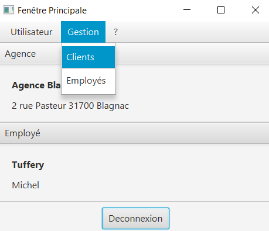
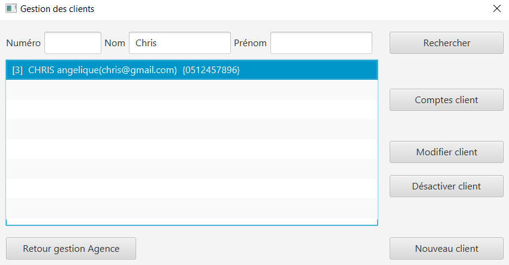
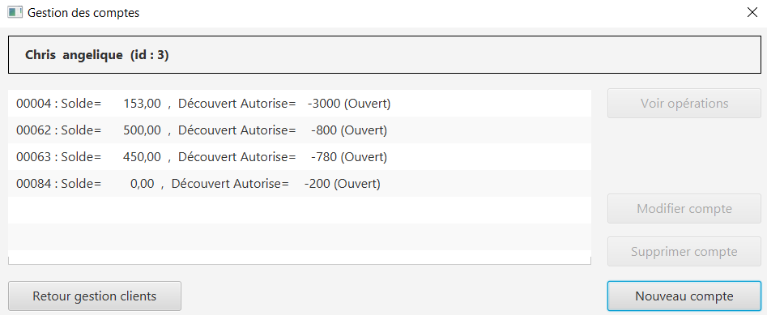
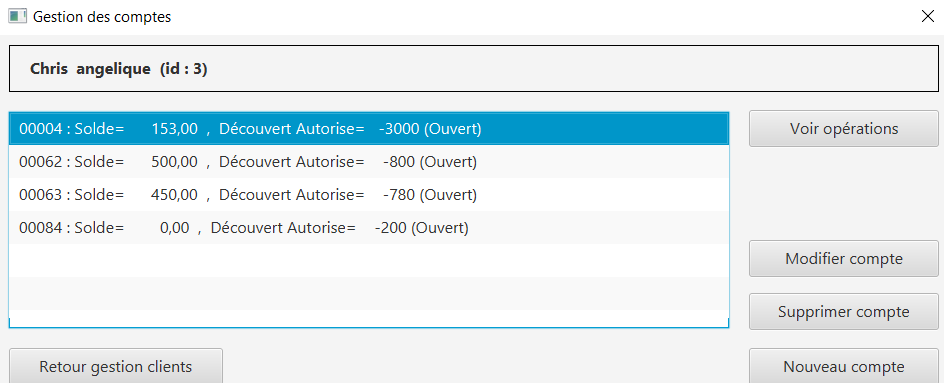

# DOCUMENTATION UTILISATEUR VERSION 0
:toc: left
:toc-title: Table des matières
:icons: font
:nofooter:

Version de l’application : 0
Date : semaine 20
Equipe : Christopher / Ruben / Yaan 
Client : BankUniv
Projet : DailyBank

## Présentation générale

### Objectifs de l'application

L’objectif recherché par la banque DailyBank est de développer une application Java-Oracle de gestion de comptes, pour remplacer plusieurs outils obsolètes. +
Cette nouvelle version de l'appliation permettra de gérer les clients de l'Agence ainsi que leur comptes bancaire. De la même manière, il sera possible de gérer les opérations de chacun de ces comptes. Cette nouvelle version de l'application permettra aussi de gérer les employés de l'Agence bancaire.

## Installation de l'application

Pour pouvoir lancer l'application, l'installation de Java en version 1.8 est nécessaire.
Pour ce faire, vous devez  suivre ces étapes : 

* Télécharger gratuitement la version 1.8 de Java sur le https://www.java.com/fr/download/[site d'Oracle]
** Vous pouvez au préalable vérifiez que l'installation c'est bien réaliser (depuis un terminal) :

    $ java -version 

Ensuite lancer le fichier .jar depuis un terminal (si il ne s'ouvre par en double cliquant dessus) :

(depuis un terminal) :

    $ cd '.\Desktop\DailyBank workspace\'
    $ java -jar Dailybank.jar

## Utilisation de l'application

L'utilisation de l'application DailyBank se fait par deux utilisateurs distincts : 

*Les guichetiers* : Ils possèdent les droits leur permettant de gérer les clients de l'Agence bancaire ainsi que leur comptes. +
Ainsi ils peuvent :

* gérer les clients de l'Agence bancaire :

** Rechercher les clients 
** Ajouter de nouveaux clients 
** Modifier les informations des clients

* gérer les comptes bancaire des clients :

** voir les opérations d'un compte bancaire

*Les Chefs d'Agence* : Ils possèdent les mêmes droits que les guichetiers et gèrent en plus les employés. +
Ainsi ils peuvent : 

* gérer le CRUD des employés

## Fonctionnement de l'application

### quitter l'application

TIP: Un bouton « quitter » est accessible depuis l'onglet « utilisateur » 

En cliquant sur le bouton « quitter » une fenêtre de confirmation s'affiche. +
Au clique du bouton « ok » si une connexion avec un compte à été établie, celle-ci s'arrete et la fenêtre de l'application se ferme. +

Au clique du bouton « annuler » l'application continue de fonctionner et la fenêtre de confirmation se ferme.  

image:img/quitter-appli.png[]

### Connexion à un compte

TIP: Un bouton « connexion »  est accessible depuis l'onglet « utilisateur » 

En cliquant sur le bouton « connexion » une fenêtre d'identification s'affiche. +
Au clique du bouton « valider » une vérifiation des champs de saisie s'effectue. Si ils sont vides, un message d'erreur s'affiche. +
Si le login et le mot de passe appartiennent à un compte de l'Agence, une connexion est établie. +

Au clique du bouton « annuler » aucune connexion n'est établie et la fenêtre d'identification se ferme.

image:img/connection.png[]

image:img/erreur-connection.png[]

### Deconnexion d'un compte

TIP: Un bouton « deconnexion »  est accessible depuis l'onglet « utilisateur » 

Au clique du bouton « déconnexion », la connexion actuellement établie s'arrête.

image:img/deconnection.png[]

### Gestion des clients

NOTE: Cette fonctionnalité n'est accessible que si l'utilisateur est connectée. +
Cette fonctionnalité est accessible depuis l'onglet « gestion »
Tous les utilisateurs ont accès à cette fonctionnalité.

En cliquant sur le bouton « clients » la fenêtre de gestion des clients s'ouvre.

image:img/gestion-client2.png[]

### Recherche d'un client

NOTE: Tous les utilisateurs ont accès à cette fonctionnalité.

En cliquant sur le bouton « rechercher » la liste des clients ainsi que leur informations s'affiche sur la fenêtre. +
Les résultats peuvent être affinés en entrant les informations :

* Numéro (numéro du client)

* Nom

* Prénom

image:img/recherche-client.png[]

### Création d'un nouveau client

NOTE: Tous les utilisateurs ont accès à cette fonctionnalité.

En cliquant sur le bouton « nouveau client » la fenêtre de création d'un client s'affiche. +
En cliquant sur le bouton « ajouter » les préconditions se vérifie : 

* les champs de saisies ne sont pas vides
* le numéro de téléphone à exactement 10 chiffres
* le mail contient les caractères : @_saisie_._saisie_

Si une préconditions est fausse, une fenêtre d'erreur s'affiche sinon le nouveau client se créer. +

Au clique du bouton « annuler » la création du client s'annule et la fenêtre de création d'un client se ferme.

image:img/nouveau-client2.png[]
image:img/nouveau-client-erreur.png[]

### Modification d'un client

NOTE: Un client doit être sélectionner pour effectuer cette action. +
Tous les utilisateurs ont accès à cette fonctionnalité

En cliquant sur le bouton « modifier client » la fenêtre de modification d'un client s'affiche. +
En cliquant sur le bouton « modifier » les préconditions se vérifie : 

* les champs de saisies ne sont pas vides
* le numéro de téléphone à exactement 10 chiffres
* le mail contient les caractères : @_saisie_._saisie_

Si une préconditions est fausse, une fenêtre d'erreur s'affiche sinon le client se modifie. +

Au clique du bouton « annuler » la modification du client s'annule et la fenêtre de modification d'un client se ferme.

image:img/modification-client2.png[]
image:img/modification-client-erreur.png[]

### Gestion des comptes bancaire d'un client

TIP: Un client doit être sélectionner pour effectuer cette action. +
Tous les utilisateur ont accès à cette fonctionnalité

En cliquant sur le bouton « comptes client » la fenêtre de gestion des comptes bancaire d'un client s'ouvre permettant de gérer les compte d'un client.

image:img/gestion-compte.png[]

### voir les opérations d'un compte

TIP: Cette fonctionnalité est accessible en sélectionnant un compte. +
Tous les utilisateur ont accès à cette fonctionnalité. +
Un compte doit être sélectonner.

En cliquant sur le bouton « voir opération » la fenêtre de gestion des opération s'ouvre, permettant à l'utilisateur de gérer les opération d'un compte bancaire.

image:img/gestion-operation2.png[]
